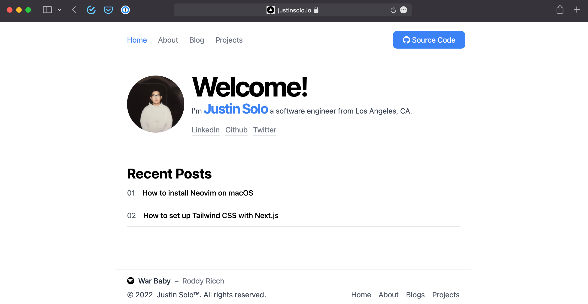

  <h1>justinsolo.io</h1>
  
🚀 Personal website and blog made using Next.js, TypeScript, and Tailwind CSS.

> ## Features

- Blog using MDX
- Spotify API (now playing)
- Selft hosted with Vercel
- NextAuth for authentication

> ## Tech Stack

- Next.js
- Tailwind CSS
- Vercel
- TypeScript

> ## Todo
- [ ] Update ui
- [ ] Guessbook
